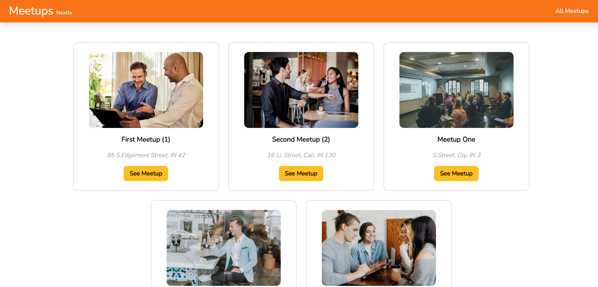

# Meetups

Creating meetups project with nextjs, tailwindcss and strapi

    

## Features
- handling static site generation (SSG) and incremental static regeneration (ISR)
- fetch data from strapi
- connecting to strapi with API
- styling with tailwindcss
- responsive

